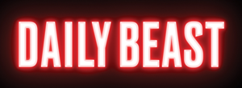
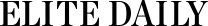
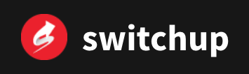

 
 

### Hey, I’m Justin

I’m currently pushing code at Microsoft and living in Seattle, WA.

Outside of work I spend as much time outside as possible hiking, camping and have a bit of a snowboarding problem. 

In June 2017, I graduated from [The&nbsp;Firehose&nbsp;Project](http://www.thefirehoseproject.com) coding bootcamp, where I apprenticed building full-stack web apps using ruby and javascript. Aftwerwards, they hired me as part-time technical support: answering student questions, debugging rails apps, and contributed to the curriculumn source code. I started as a contractor working for Microsoft Email Orchestrator, an internal transactional email service. In November of 2019, I was brought on as a full-time employee. My focus on MEO was to standardize our email templates across products and services at Microsoft, build out an internal Admin UI, and accesibility champion. In November of 2021, I moved to Microsoft Learn, where I focus on building out the UI and UX for users to better themselves by learning technologies and earning certifications. I'm also passionate about Design Systems and Accessibility and regularly contribute to Learn's internal design system and give knowledge share talks. Our stack includes typescript, webcomponents, and connecting with APIs built in ASP.Net Core and Azure Functions.

Previously I co-founded a tweet to donate platform that raised over $100k for progressive organizations like ACLU, Planned Parenthood, and NRDC called <strong>Donald Donates</a>. We had over 400 users and were featured in Press from reputable organizations as well as gave an interview on Switchup about building out a product while in a coding bootcamp.

Before pivoting my career to software engineering, I had a degree in Digital Multimedia and worked as a graphic designer for 9 years, eventually working as a Web Designer. Jobs ranged from screen printing, city government, e-commerce. I also worked as a freelance designer focused on web design and development and logos. Clients include multiple NFL players and Ad agencies.

<h4 class="press">
  <strong>Press:</strong>
   
  
  
  
  
</h4>

#### Skills
Javascript
Typescript
C#
ASP.NET Core
HTML
CSS
Sass
LESS
Git
Github
Microsoft Azure
Azure DevOps

#### Focus
Front-end development
UI development
UX development
Design systems
Accessibility
End to End testing
On call Site reliability engineering

 
### Background

I'm a born and bred Carolinan, in both South and North Carolina respectively. While living in Raleigh I became a proud husband and uncle. We recently had our first child and it's hard to believe he's already become a toddler.

From June 2014 to Jan 2018, I worked remotely full-time and followed my wife's nursing contracts around the US. During that time we moved every 4 months living from Delaware to Alaska and many places in between.

In January 2018 we decided to settle in Seattle, WA with our cat and dog. I joined Microsoft as a contractor in April of 2018, converted to full-time in 2019 and have been pushing code in highly performant and visible products ever since.
